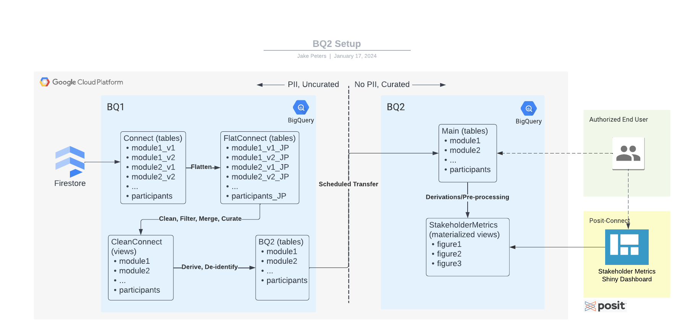

# bq2

SQL query development for Connect for Cancer Preventions' BQ2 database.

## Contents

-   `generate_bq2_queries.qmd` is an R notebook that generates SQL queries for each BQ2 table
-   Queries are written to a `.sql` file in the `sql/` subdirectory.
-   Custom GoogleSQL functions are written to `.sql` files in the `custom_sql_functions/` sub-directory. Each function is written for a particular use case that is described in the header comment of the file.

## Intention for this repository

All members of the BQ2 team can clone the "main" branch of this repo. Pull requests should be limited to improvements to the code that are well documented and will work in everyone's environment. Once CI/CD protocols are required to push this code to GCP, we can set up a 'dev', 'stg' and 'prod' branch. Documentation for all transformations performed will be documented below.

------------------------------------------------------------------------

# Documentation of Transformations from BQ1 to BQ2

For each query_generator (i.e., for each table), our process will be:
1. Generate list of **all** variables from BQ schema
2. Remove **all** PII
3. Remove **all** Deprecated vars
4. Remove **all** variables that are not in data dictionary
5. Explicitly add exceptions to he above removals with appropriate handling (e.g., COALESCE)
   - Assign each specific case to an issue and document separately
   - Use seperate custom_r_functions for each use case
     
**NOTE:**
- Each inclusion, exclusion or transformation criterion should be associated with a seperate function
- Each function should generate a mini-report that lists all varaibles that were affected so that these decisions can be documented and reviewed by non-technical Connect folks.

[Lucid Chart](https://lucid.app/lucidchart/7d4864f5-3e19-4210-8da8-99a6c98ff6b7/edit?viewport_loc=-404%2C-59%2C3328%2C1587%2C0_0&invitationId=inv_45fd4ac7-8213-43b5-951d-240389f6b138)

Below we will document transformations that are (A) planned, (B! in-progress, and (C) finalized, for each dataset. This will serve to organize the bq2 team and help us communicate with leadership about problems we identify and solutions that we implement.

These generic transformations will be applied to each table:

-   Filter out PII-variables
-   Filter out participants (verification status, consent)
-   Merge multiple versions of tables (or of variables)
-   QC check and correct variable names
-   QC check and correct values

### Module 1

-   Partition YEAR and AGE into seperate columns [CID: d_317093647] <https://github.com/Analyticsphere/bq2/issues/8>
-   Correct/consolidate CIDs for <SURGERY_AGE> and <SURGERY_YEAR> <https://github.com/Analyticsphere/bq2/issues/4>
-   Convert 0/1 to yes/no (CIDs: 104430631/353358909) for *select-all-that-apply* variables <https://github.com/Analyticsphere/bq2/issues/5>
-   Remove unnecessary brackets from "false array" viarables - [CID1], [CID2], [], NULL --\> CID1, CID2, NULL <https://github.com/Analyticsphere/bq2/issues/6>
-   Consolidate loop variables w/ similar "CID2_N_CID3_N" naming patterns <https://github.com/Analyticsphere/bq2/issues/7>

### Module 2

### Module 3

### Module 4

### Clinical Biospecimen Survey

### Participants

### Biospecimen

### Biospecimen Survey

### Covid-19 Survey

### Menstrual Survey
