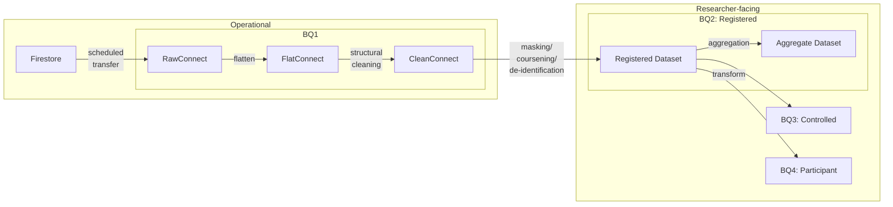

## Operational

##### Firestore
- item 1
- item 2

##### BQ1: 
- item 1
- item 2

## Researcher-facing

##### BQ2: Registered
- item 1
- item 2

##### BQ3: Controlled
- item 1
- item 2

##### BQ4: Participant Return of Results
- item 1
- item 2
